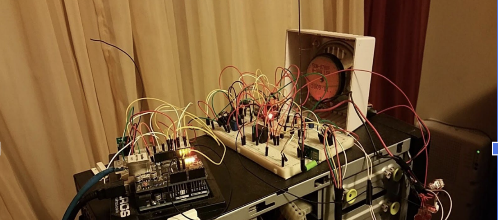
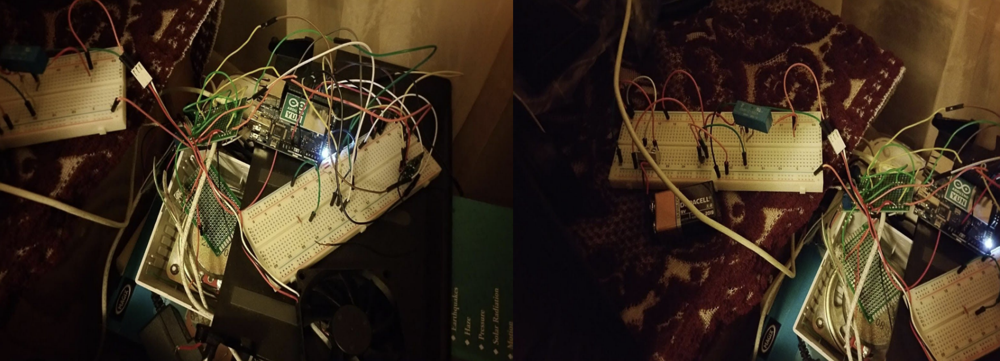

# Smart-Door-Bell

 
 

My home doorbell stopped working so I decided to fix it and make the doorbell smarter. This project takes advantage of the representational state transfer (REST) architecture. Using the Following programming languages  C++, PHP, Python, HTML, MYSQL database, Linux, and  REST application programming interface (API)s available on the Arduino Yun. The app on the user's mobile smartphone constantly pings the server on the Arduino Yun and checks if the button is pressed via a javascript object notation table (JSON). If the JSON table returns a 1 it will send a notification to the phone telling the user if some are at the front or back door. Also, the Arduino microcontroller will play a doorbell sound off an SD card using an amplifier to let the user know someone rang the doorbell. I also used a radio FM transmitter and a receiver to allow the server to be mobile independent of the speaker. This project is still being developed.
 
 
<a href="https://www.youtube.com/watch?v=TNn2bbBcvAU&t=2s">Video 1 <a/> 
 
 
<a href="https://www.youtube.com/watch?v=RNShFsK0FeE">Video 2<a/> 
 
 
<a href="https://www.youtube.com/watch?v=cySd4hvtEZA">Video 3<a/> 
 
 
<a href="https://www.youtube.com/watch?v=5audmtglBHo">Video 4<a/>
